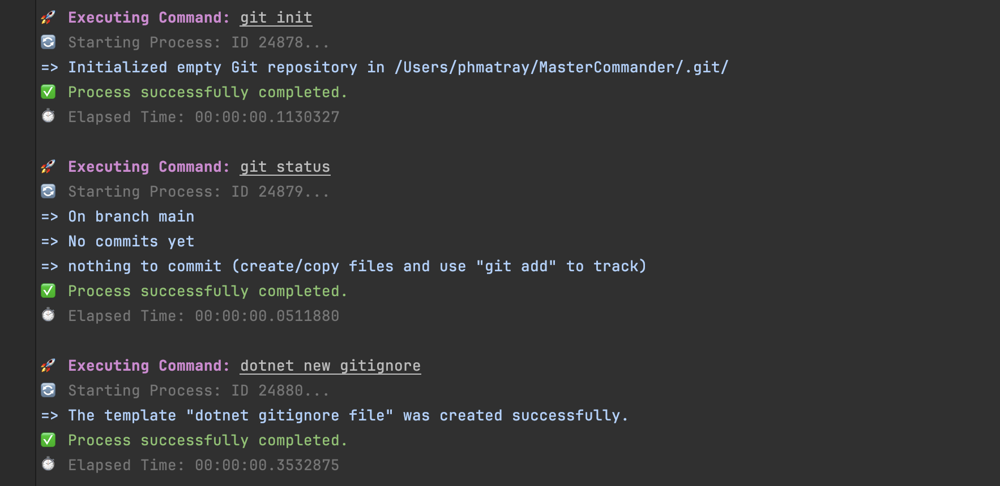

# MasterCommander

|  | MasterCommander is a versatile command-line utility designed to streamline the workflow for developers working with multiple technology stacks. By integrating common operations for Git, .NET, Docker, and npm into a single application, MasterCommander enhances productivity and simplifies project setup and management tasks. |
|-------------------------------------|-------------------------------------------------------------------------------------------------------------------------------------------------------------------------------------------------------------------------------------------------------------------------------------------------------------------------------------|

## Features

MasterCommander provides a unified interface to interact with various development tools, including:

- **.NET Projects**: Easily create new .NET solutions and projects.
- **Git Integration**: Initialize new repositories, check status, and more with built-in Git commands.
- **Docker Support**: Manage Docker containers and images through simple commands.
- **npm Packages**: Handle npm packages and run npm scripts within your projects.

## Screenshots

Write code, not commands. MasterCommander provides a simple, consistent interface for common development tasks.

Use your favorite CLI tools without leaving your code editor:

```csharp
private const string SdkVersion = "8.0.101";
private const string SolutionName = "AppDemo";
private const string ConsoleProjectName = $"{SolutionName}.Console";
private const string ConsoleProjectDirectory = $"src/{ConsoleProjectName}";
private const string ConsoleCsproj = $"{ConsoleProjectDirectory}/{ConsoleProjectName}.csproj";

await git.InitAsync();
await git.StatusAsync();
await dotnet.NewAsync(new DotnetNewGitignoreOptions());
await dotnet.NewAsync(new DotnetNewEditorConfigOptions());
await dotnet.NewAsync(new DotnetNewNuGetConfigOptions());
await dotnet.NewAsync(new DotnetNewGlobalJsonOptions { SdkVersion = SdkVersion });
await dotnet.NewAsync(new DotnetNewSolutionOptions { OutputName = SolutionName });
await dotnet.NewAsync(new DotnetNewConsoleOptions { OutputName = ConsoleProjectName, OutputDirectory = ConsoleProjectDirectory });
await dotnet.SlnAddAsync(ConsoleCsproj);
await dotnet.BuildAsync();
await dotnet.BuildAsync(new DotnetBuildOptions { Configuration = "Release" });
await dotnet.RunAsync(new DotnetRunOptions { Project = ConsoleCsproj, Configuration = "Release" });
``` 


Output from MasterCommander commands is displayed in a clean, readable format:
> 

## Getting Started

### Prerequisites

To use MasterCommander, ensure you have the following installed on your system:

- Git
- .NET SDK (version 8.0.101 or later)
- Docker (optional)
- Node.js and npm (optional)

### Installation

Currently, MasterCommander needs to be compiled from source. Follow these steps to get started:

1. Clone the repository to your local machine.
2. Navigate to the cloned directory and build the project using the .NET CLI: `dotnet build`.
3. Run the application with `dotnet run` from within the source directory.

Or... open the project in Visual Studio (or JetBrains Rider) and run the application from the IDE.

### Usage

Upon launching MasterCommander, the application will present you with a simple command-line interface. Here's a quick overview of available commands:

- **.NET Commands**:
    - `dotnet new`: Create a new .NET solution or project.
    - `dotnet build`: Build a .NET project.
    - `dotnet run`: Run a .NET project.
    - `dotnet test`: Run unit tests for a .NET project.
- **Git Commands**:
    - `git init`: Initialize a new Git repository.
    - `git status`: Display the status of the current Git repository.
    - `git clone`: Clone a remote Git repository.
    - `git commit`: Commit changes to the current Git repository.
- **Docker Commands**:
    - `docker build`: Build a Docker image.
    - `docker run`: Run a Docker container.
    - `docker stop`: Stop a running Docker container.
    - `docker rm`: Remove a Docker container.
- **npm Commands**:
    - `npm init`: Initialize a new npm package.
    - `npm install`: Install npm packages.
    - `npm update`: Update npm packages.
    - `npm start`: Start an npm script.
    - `npm run`: Run an npm script.

To perform an action, simply type the command and follow any prompts.

## Contributing

Contributions to MasterCommander are welcome! Whether it's reporting bugs, discussing improvements, or submitting pull requests, all contributions help make MasterCommander a better tool for developers.

Before submitting pull requests, please ensure you have discussed the proposed changes with the project maintainers.
